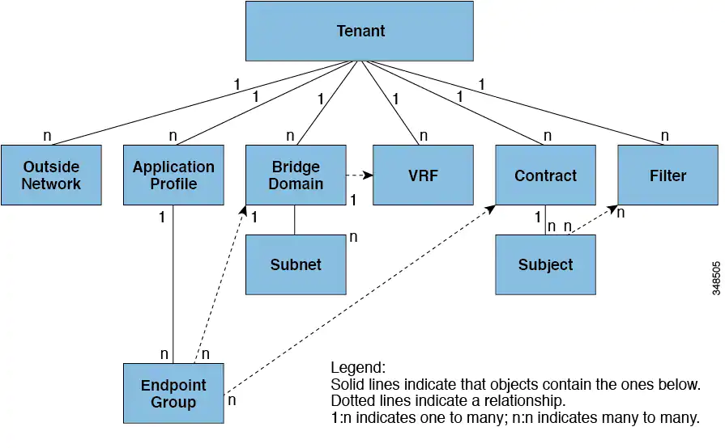

# Cisco-Application Centric Infrastructure

declarative control of the network.
Write application requirements, put them in to the black box and get your network.
Controller hide all the networking complexity, only those are static and debugable.
Everything behind that is dynamic.

## Ressources

- [Learning ACI](https://adamraffe.com/learning-aci/)
Past cisco engineers blog for starting out
- [ACI Fundamentals](https://www.cisco.com/c/en/us/td/docs/switches/datacenter/aci/apic/sw/1-x/aci-fundamentals/b_ACI-Fundamentals.html)
offilial technical reference

### Highlights

ACI is build upon Nexus 9000 switches for the physical switching infrastructure and APICs for the clustered policy management system.

ACI uses Leaf and spine nodes. A leaf node is connected to all spine nodes in the fabric with no connectivity beween leaves or beween spine switches.
All server, host, services and external connectivity is via leaf nodes.
Only the leaf nodes themself are connected to the spine nodes.

ACI uses Policies to define how applications and attached systems communicate.
Policies are also used to define most system configuration and administration.

### ACI Policy Model

The state is defined in the model.
When making changes, those are first applied to the model and then rolled out to the nodes.

The model is split into the logical and concrete domains.
The logical lies in configurations and the concrete gets automatically createt by the model

### Policies

- Access policies:
governs opeation switch access.
Allows for custom protocols between switches.
- Fabric policies:
governs operations of switch fabric ports (ntp, synchronization, dns)

### Domain based Access Control

Extensions to RBAC models (user get roles, roles have access rights).
Addresses Issues like policy expression an management, roles management, rights and privileges delegation and AuthZ session management. 
This allows for splitting (basis - prod)

### Tenants

A Tenant is a logical container for policies for access crontrol.
It represents a unit of isolation from a policy perspective, but does not represent a private network.
Tenants can represent a customor, an organisation or just a convenient group of policies.
They can share ressourses.

- User tenants: 
administer user applications (databases, webservers, nas, vms..).
Must be configured for layer 4-7 services.
- common Tenant:
(automatic administration) governs vxlan overlay
- infrastructure tenant: 
provided, but can be administred.
governs the __operation__ of infrastructure (vxlan)
allows for selective deployment of ressources to user tenants.
- management tenant:
governs the operation of fabric management functions for in-band, out-of-band configuration of fabric nodes.
contains private out-of-bound address space for the APIC 

Tenants contains filters, contracts, outside networks, bridge domains, VRFs and EPGs.

#### VRF: Virtual Routing and forwarding instances

an vrf objet (fvCtx, context) is a tenant network (also called private netork), so one Tenant can have multiple VRFs).
It is a layer 3 forwarding and application policy domain (address domain).
One or more bridge domains are associated with an VRF.
All of the Endpoints within the layer 3 domain must have unique ip addresses, because it is allowed to forwards packets directly between these devices.

#### fvAp: Application Profile

An application profile defines the policies, services and relationships beween one or more EPGs.
They group together all components making up an application. (e.g. db + web server)

#### EPG endpoint group: 

managed object, that is a named logical entity, that contains a collection of dynamic or static endpoints.
They have an address, a location and attributes.

EPGs contain enpoints, that have a common policy requirements such as security, virtual machine mobility, etc.
This enables managment of these endpoints as a group and policies are never applied to a single endpoint.

When an EPG uses a static binding path, the encapsulation VLAN associated must be part of a static VLAN pool.
When a leaf switch is configuredd for static binding under an epg, 
it cannot overide the path and it's interfaces  cannot be used for routed external network or assigning Ip addresses
IP6 is special, check the docs for that, there is also a wan router example.

#### Microsegmentation

Microsegmentation associates endpoints from multiple EPGs into a microsegmented EPG according to thir Attributes.
This allows for stateless white list network access or moving problematic vms into a quarantine security zone.

__They can be combined with intra-EPG isolation for bare metal and VM endpoints to provide policy driven automated complete endpoint isolation.__

#### Intra-EPG Entpoint Isolation

Intra-EPG endpoint isolation policies  provide full isolation for virtual or physical enpoints.
Isolation enforced EPGs reduce the number of EPG encapsulations required when many clients access a common service, 
but are not allowed to communicate with each other.
All Layer 2 endpoint communication within a bridge domain is dropped.
All Layer 3 endpoint communication within the same subnet.
Preserving QoS CoS priority settings is not supported when traffic is flowing from an EPG with isolation enforced to an EPG without isolation enforced
(whatever that means).

#### fvBD: Bridge Domains and Subnets

A bridge domain represents a layer 2 forwarding construct within the fabric.
They must be linked to a context and have at least one subnet that is associated with it.
While a context (vrf object) defines a unique IP address space, that address space can consist of multiple subnets, who are defined in ore or more bridge domains.
These subnets can be public (exported to a routed connection) private (subnet only within its tenant) or shared (shared to multiple contextes).
Shared Subnets must be unique accros the contests involved in the communication.

A Bridge Doman can operate in flood mode for unknown unicast frames or in an optimized mode that elimitates flooding these frames.
Switching this mode is __disruptive to the traffic__. 
They also have way more configuration option like unixats routing, setting the Subnett Address and limiting IP learning.

#### AEP: Attachable Entity Profile

The ACI frabric provides mutliple attachement points that connect through leaf notes to external entities.
These attachement points can be physical ports, FEX porsts, port channels or a virtual port channel.

An attachable Entity Profile (AEP) represents a group of external entities with similar policiy requirements.
It is required to deploy VLAN pools on leaf switches, since it provides the scope of the vlan pool to the physical infrastructure.
It defines the range of allowed vlans, but it does not provision them (EPG must be deployed)

A VMM manager domain automatically derives physical interface policies from the interface policy groubs of an AEP.

## Upgrading

One upgrade upgrades all Switches, routers, etc.
If something breaks you are fucked.

rz1

500 - storage - pod 5
100 - aci leaf  - pod 1
200 - aci leafe - pod 2

3 aci
4 - aci
6 - storage
