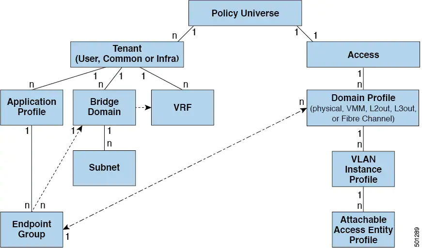

# VLAN's and EPGs

## Access Policies Automate Assigning VLANs to EPGs

tenant network policies are configured separately from frabric access policies.
They are not activated unless their underlying access policies are in place.
Access policies enable an administrator to configure port channels and virtual port channels for external facing interfaces.

EPGs are tightly coupled with vlans, since an EPG must be deployed on a leaf port with a Networking Domain Profile for traffik to flow.

The domain profile contains the vlan instance profile. and the Access Entity Provile (AEP), which are associated with the EPG.
The AEP deploys the associated application EPGs to all the ports to which it is attached and automates the task of assigning VLANs.

Multiple domains can share a VLAN pool, but a single domain can only use one VLAN pool
Multiple EPGs with the same VLAN encapsulation on a single leaf switch can be deployed using _Per Port VLAN_

### Dropped VLAN 0 packages.

Certain older network interface cards (NICs) that send traffic on the native VLAN untagged, drop return traffic that is tagged as VLAN 0.
This is normally only a problem on interfaces configured as trunk ports.
However, if an Attachable Entity Profile (AEP) for an access port is configured to carry the infra VLAN, then it is treated as a trunk port, even though it is configured as an access port.
In these circumstances, packets sent on the native VLAN from the switch with Network Flow Engine (NFE) cards will be tagged as VLAN 0, and older switch NICs may drop them.
Options to address this issue include:

- Removing the infra VLAN from the AEP.

- Configuring "port local scope" on the port. This enables per-port VLAN definition and allows the switch equipped with NFE to send packets on the native VLAN, untagged.

## VLAN in tunnel mode

ACI used Bridge Domain as the Layer 2 broadcast boundary and each BD can include multiple EPGs.
In some design szenarios flooding can cross different user VLANs when the EPGs are in the same BD

Using multiple VLANs in tunnel mode can introduce a few chanllenges.
Certain traffic is flooded within the BDj

## vzBrCP: Contracts

Contracts (vzBrCP) control the type(s) of traffic that can pass between EPGs, including the protocols and ports allowed.
Contract preferred groups can be configured additonally to enable greater control of communications. 

Contract can contain multiple communication rules and multiple EPGs can both consume and provide multiple contracts.

__LABELS__ control which rules apply when communication beween a specific pair of EPGs.
Label matching is done first, if labels do not match, no other contract or filter information is processed.
They can be applied to multiple types of objects (EPG, contracts, ...) but do not apply accros object types.

The two types of labels are as follows:
- Subject labels that are applied to EPGs. Subject label matching enables EPGs to choose a subset of the subjects in a contract.
- Provider/consumer labels that are applied to EPGs. Provider/consumer label matching enables consumer EPGs to choose their provider EPGs and vice versa.

__ALIASE__ are alternative names you can apply to objects, which can be changed unlike the name

__Filters__ are Layer 2 to layer 4 fields, such as protocol types, layer 4 ports.
An EPG provider dictates the protocols and ports in both directions.
Contract subjects contain associations to the filters that are applied between EPGs that produce and consume the contract.
When a contract filter match type is All, best practice is to use the VRF unenforced mode.
Under certain circumstances, failure to follow these guidelines results in the contract not allowing traffic among EPGs in the VRF

__SUBJECTS__ are contained in contracts.
One ore more jubjects within a contract use filters to specify the type of traffic that can communicate and how it occurs.
For HTTPS the sujbject specifies the directionand the filters that specify the IP address type (IPv4), the HTTP protocol and the ports allowed.
